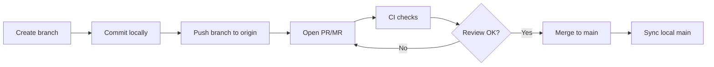
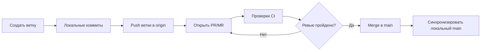

🚀✨ **Welcome to the World of Git** ✨🚀  

🔧 Git is not just a tool — it’s your **time machine**, your **safety net**, and your **teamwork compass**.  
🌍 With it, dozens of developers can hack on the same project without stepping on each other’s toes.  
⚡ Master these commands, and you’ll move from *“just coding”* → to *“collaborating like a pro”*.  

---

---

# Git Usage — From Zero to Team Workflow

*English & Русский versions with copy-pasteable commands*

---

## 🇬🇧 English Version

> A practical, minimal-to-advanced Git guide for everyday team work. Copy, paste, ship.

### 0) TL;DR Cheat Sheet

```bash
# First-time setup
git config --global user.name "Your Name"
git config --global user.email "you@company.com"
git config --global init.defaultBranch main
git config --global core.autocrlf true      # Windows
# git config --global core.autocrlf input   # macOS/Linux/WSL

# Start a repo (local → remote)
mkdir myproj && cd myproj
git init
echo "# My Project" > README.md
git add .
git commit -m "feat: init"
git branch -M main
git remote add origin git@github.com:org/myproj.git
git push -u origin main

# Daily feature flow
git checkout -b feat/my-task
# ...edit files
git add -A
git commit -m "feat: implement X"
git push -u origin feat/my-task
# Open PR on GitHub/GitLab (web) → review → merge

# Sync with main
git checkout main && git pull
git checkout feat/my-task && git merge main   # or: git rebase main

# Fix conflicts → stage resolved files → commit
git add path/to/conflicted_file
git commit
git push
```

---

### 1) First-time Configuration (once per machine)

```bash
git config --global user.name "Your Name"
git config --global user.email "you@company.com"
git config --global init.defaultBranch main
git config --global core.autocrlf true      # Windows
# For macOS/Linux/WSL prefer:
# git config --global core.autocrlf input
# Optional goodies:
git config --global pull.rebase false
git config --global alias.lg "log --oneline --graph --decorate --all"
git config --global core.editor "code --wait"  # VS Code as editor
```

**SSH key (recommended):**

```bash
ssh-keygen -t ed25519 -C "you@company.com"
cat ~/.ssh/id_ed25519.pub   # add to GitHub/GitLab → Settings → SSH Keys
ssh -T git@github.com
ssh -T git@gitlab.com
```

---

### 2) Create / Clone

```bash
# Create new repo locally and push
git init
git add .
git commit -m "chore: initial commit"
git branch -M main
git remote add origin git@github.com:org/repo.git
git push -u origin main

# Clone existing remote
git clone git@github.com:org/repo.git
cd repo
git remote -v
```

---

### 3) Daily Workflow (feature branches)

```bash
git checkout -b feat/my-task       # or fix/bug-123, docs/guide, refactor/api
# ...edit files
git status
git add -A                         # add changes (use -p for interactive)
git commit -m "feat: add user login (JWT)"
git push -u origin feat/my-task
# create PR/MR on web → reviewers → merge strategy (squash/merge/rebase)
```

**Commit message tips (Conventional Commits):**
`feat: ...` `fix: ...` `refactor: ...` `docs: ...` `test: ...` `chore: ...`

---

### 4) Inspect & Compare

```bash
git lg                      # pretty graph (alias above)
git log -p                  # show patches
git diff                    # unstaged changes
git diff --staged           # staged vs HEAD
git blame path/file.py      # who changed which line
```

---

### 5) Sync & Branch Management

```bash
git fetch                    # update refs without merging
git pull                     # fetch + merge (or rebase if configured)
git branch                   # list branches
git switch main              # modern switch
git merge main               # merge main into current branch
git rebase main              # replay commits on top of main (clean history)
git push                     # push current branch
git push -u origin my-branch # set upstream once
```

> **Rule of thumb:** use `merge` while learning; move to `rebase` once comfortable. Don’t rebase public/shared branches.

---

### 6) Conflict Resolution (when it happens)

Git marks conflicts like:

```diff
<<<<<<< HEAD
result = add(a, b)
=======
result = a + b
>>>>>>> origin/main
```

Resolve by editing to the correct final code, then:

```bash
git add function.py
git commit
git push
```

---

### 7) Undo & Recovery (safe to advanced)

```bash
git restore path/file.py                 # discard unstaged changes
git restore --staged path/file.py        # unstage, keep in working tree
git commit --amend                       # edit last commit (local only)
git revert <commit>                      # make a new commit that undoes
# Reset: use with care (don’t rewrite shared history)
git reset --soft  <commit>               # keep changes staged
git reset --mixed <commit>               # default; keep changes unstaged
git reset --hard  <commit>               # nuke changes
# Lifesaver:
git reflog                               # browse every HEAD move
git checkout HEAD@{1}                    # jump to previous HEAD
```

---

### 8) Stashing (save work-in-progress)

```bash
git stash push -m "WIP: parser refactor" -u  # include untracked (-u)
git stash list
git stash show -p stash@{0}
git stash pop   # apply + drop
# or:
git stash apply stash@{1}
git stash drop stash@{1}
```

---

### 9) Tags & Releases

```bash
git tag v1.0.0                # lightweight
git tag -a v1.0.0 -m "Release 1.0"   # annotated
git push origin v1.0.0
git push origin --tags
```

---

### 10) Cherry-pick (move a commit)

```bash
git checkout release/1.0
git cherry-pick <commit-sha>
```

---

### 11) Git LFS (large files: models, assets)

```bash
git lfs install
git lfs track "*.pt"
git lfs track "*.onnx"
git add .gitattributes
git add model.pt
git commit -m "feat: add model via LFS"
git push
```

---

### 12) Submodules (pin external repos)

```bash
git submodule add git@github.com:org/libfoo.git third_party/libfoo
git submodule update --init --recursive
# Pull all submodules updates:
git submodule update --remote --merge
```

---

### 13) Partial / Fast Clones

```bash
# Shallow
git clone --depth 1 git@github.com:org/bigrepo.git
# Partial (blobless) + sparse checkout
git clone --filter=blob:none --sparse git@github.com:org/bigrepo.git
cd bigrepo
git sparse-checkout set src include tools
```

---

### 14) .gitignore & .gitattributes (essentials)

**.gitignore**

```
# Build
build/
out/
*.o
*.obj
*.exe
*.dll
*.so
*.dylib

# IDE
.vscode/
.idea/
*.code-workspace

# Logs / temp
*.log
*.tmp
```

**.gitattributes (normalize line endings across OS)**

```
* text=auto
*.sh  text eol=lf
*.bat text eol=crlf
```

---

### 15) Typical PR/MR Flow (commands summary)

```bash
git checkout -b feat/awesome
git add -A
git commit -m "feat: awesome"
git push -u origin feat/awesome
# open PR/MR on web → CI passes → reviewer approves → merge (prefer squash)
git checkout main && git pull
git branch -d feat/awesome           # local cleanup
git push origin --delete feat/awesome
```

---

### 16) Fork Workflow (upstream remote)

```bash
git clone git@github.com:yourname/repo-fork.git
cd repo-fork
git remote add upstream git@github.com:upstream-owner/repo.git
git fetch upstream
git checkout main
git merge upstream/main     # or: git rebase upstream/main
git push
```

---

### 17) Handy Aliases

```bash
git config --global alias.co "checkout"
git config --global alias.br "branch"
git config --global alias.ci "commit"
git config --global alias.st "status -sb"
git config --global alias.last "log -1 --stat"
git config --global alias.tree "log --graph --decorate --all --oneline"
```

---

### 18) Visual Workflow (Mermaid)



---

## 🇷🇺 Русская версия

> Практичный гайд по Git для ежедневной командной работы. Копируйте команды и используйте.

### 0) TL;DR Краткая шпаргалка

```bash
# Первичная настройка
git config --global user.name "Ваше Имя"
git config --global user.email "you@company.com"
git config --global init.defaultBranch main
git config --global core.autocrlf true      # Windows
# git config --global core.autocrlf input   # macOS/Linux/WSL

# Новый репозиторий (локально → на сервер)
mkdir myproj && cd myproj
git init
echo "# My Project" > README.md
git add .
git commit -m "feat: init"
git branch -M main
git remote add origin git@github.com:org/myproj.git
git push -u origin main

# Ежедневный цикл
git checkout -b feat/my-task
# ...изменения
git add -A
git commit -m "feat: implement X"
git push -u origin feat/my-task
# PR/MR в веб-интерфейсе → ревью → merge

# Синхронизация с main
git checkout main && git pull
git checkout feat/my-task && git merge main   # или: git rebase main

# Разрешение конфликтов → stage → commit
git add path/to/conflicted_file
git commit
git push
```

---

### 1) Первичная настройка (один раз на машину)

```bash
git config --global user.name "Ваше Имя"
git config --global user.email "you@company.com"
git config --global init.defaultBranch main
git config --global core.autocrlf true      # Windows
# Для macOS/Linux/WSL:
# git config --global core.autocrlf input
git config --global pull.rebase false
git config --global alias.lg "log --oneline --graph --decorate --all"
git config --global core.editor "code --wait"
```

**SSH-ключ (рекомендуется):**

```bash
ssh-keygen -t ed25519 -C "you@company.com"
cat ~/.ssh/id_ed25519.pub    # добавить в GitHub/GitLab → SSH Keys
ssh -T git@github.com
ssh -T git@gitlab.com
```

---

### 2) Создать / Клонировать

```bash
# Создать локальный и отправить на сервер
git init
git add .
git commit -m "chore: initial commit"
git branch -M main
git remote add origin git@github.com:org/repo.git
git push -u origin main

# Клонировать существующий
git clone git@github.com:org/repo.git
cd repo
git remote -v
```

---

### 3) Ежедневный рабочий цикл (ветки-фичи)

```bash
git checkout -b feat/my-task
# ...изменения
git status
git add -A
git commit -m "feat: добавить авторизацию (JWT)"
git push -u origin feat/my-task
# создайте PR/MR в вебе → ревью → merge (squash/merge/rebase)
```

**Сообщения коммитов:**
`feat: ...` `fix: ...` `refactor: ...` `docs: ...` `test: ...` `chore: ...`

---

### 4) Просмотр & сравнение

```bash
git lg
git log -p
git diff
git diff --staged
git blame path/file.py
```

---

### 5) Синхронизация & ветки

```bash
git fetch
git pull
git branch
git switch main
git merge main
git rebase main
git push
git push -u origin my-branch
```

> **Совет:** начните с `merge`; переходите к `rebase`, когда будете уверены. Не делайте rebase публичных веток.

---

### 6) Разрешение конфликтов

```diff
<<<<<<< HEAD
result = add(a, b)
=======
result = a + b
>>>>>>> origin/main
```

Решите вручную, затем:

```bash
git add function.py
git commit
git push
```

---

### 7) Отмена & восстановление

```bash
git restore path/file.py
git restore --staged path/file.py
git commit --amend
git revert <commit>
git reset --soft  <commit>
git reset --mixed <commit>
git reset --hard  <commit>
git reflog
git checkout HEAD@{1}
```

---

### 8) Stash (сохранить «черновик»)

```bash
git stash push -m "WIP: parser" -u
git stash list
git stash show -p stash@{0}
git stash pop
# или:
git stash apply stash@{1}
git stash drop stash@{1}
```

---

### 9) Теги & релизы

```bash
git tag v1.0.0
git tag -a v1.0.0 -m "Release 1.0"
git push origin v1.0.0
git push origin --tags
```

---

### 10) Cherry-pick

```bash
git checkout release/1.0
git cherry-pick <commit-sha>
```

---

### 11) Git LFS (крупные файлы)

```bash
git lfs install
git lfs track "*.pt"
git lfs track "*.onnx"
git add .gitattributes
git add model.pt
git commit -m "feat: добавить модель через LFS"
git push
```

---

### 12) Submodules (внешние зависимости с фиксацией версии)

```bash
git submodule add git@github.com:org/libfoo.git third_party/libfoo
git submodule update --init --recursive
git submodule update --remote --merge
```

---

### 13) Частичные/быстрые клоны

```bash
git clone --depth 1 git@github.com:org/bigrepo.git
git clone --filter=blob:none --sparse git@github.com:org/bigrepo.git
cd bigrepo
git sparse-checkout set src include tools
```

---

### 14) .gitignore & .gitattributes

**.gitignore**

```
build/
out/
*.o
*.obj
*.exe
*.dll
*.so
*.dylib
.vscode/
.idea/
*.code-workspace
*.log
*.tmp
```

**.gitattributes**

```
* text=auto
*.sh  text eol=lf
*.bat text eol=crlf
```

---

### 15) Типичный PR/MR-процесс

```bash
git checkout -b feat/awesome
git add -A
git commit -m "feat: awesome"
git push -u origin feat/awesome
# PR/MR в вебе → CI ok → ревью ok → merge (часто squash)
git checkout main && git pull
git branch -d feat/awesome
git push origin --delete feat/awesome
```

---

### 16) Форк-процесс (upstream)

```bash
git clone git@github.com:yourname/repo-fork.git
cd repo-fork
git remote add upstream git@github.com:upstream-owner/repo.git
git fetch upstream
git checkout main
git merge upstream/main     # или: git rebase upstream/main
git push
```

---

### 17) Удобные алиасы

```bash
git config --global alias.co "checkout"
git config --global alias.br "branch"
git config --global alias.ci "commit"
git config --global alias.st "status -sb"
git config --global alias.last "log -1 --stat"
git config --global alias.tree "log --graph --decorate --all --oneline"
```

---

### 18) Визуальный процесс (Mermaid)



---

**That’s it.** If you want, I can also add a small **GitLab CI** / **GitHub Actions** starter workflow file (`.gitlab-ci.yml` / `.github/workflows/ci.yml`) to this doc.
